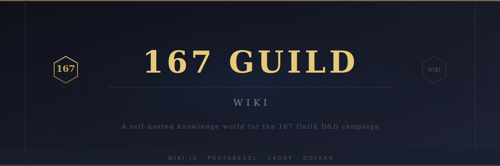

# 🐉 167guild.io



A self-hosted D&D world wiki for the 167 Guild — powered by Wiki.js, PostgreSQL, and Caddy.

[](LICENSE)

---

## Overview

167guild.io is a self-hosted knowledge portal for the 167 Guild D&D campaign. It preserves lore, session history, characters, maps, and world context.

This repository is also intended as a reusable template for future self-hosted knowledge platforms.

---

## Architecture

| Component | Role |
| --- | --- |
| **Wiki.js** | Wiki engine and content management |
| **PostgreSQL** | Primary database |
| **Caddy** | Reverse proxy and HTTPS |
| **Docker Compose** | Local and production orchestration |

See [`docs/architecture.md`](docs/architecture.md) for the full architecture and diagrams.

---

## Development

### Prerequisites

- [Docker](https://docs.docker.com/get-docker/) and [Docker Compose](https://docs.docker.com/compose/)
- [Task](https://taskfile.dev/#/installation) (auto-installed in Dev Container)

### Quick Start

```bash
# 1) Clone
git clone https://github.com/167guild/167guild.io.git
cd 167guild.io

# 2) Initialize env file and validate local compose config
task init

# 3) Run lint and formatting checks
task lint
task format

# 4) Start / stop the local stack
task up
task down
```

If you use VS Code Dev Containers, open the repository in the provided container. It installs Task CLI and creates `.env` from `.env.example` automatically when missing.

---

## Setup Portal

Deployment setup documentation lives under [`docs/setup/`](docs/setup/README.md) and is the single source of truth for:

- required environment variables
- DNS prerequisites
- Google Cloud OAuth setup
- GitHub secrets mapping
- deployment and secret rotation runbooks

---

## Available Commands

```bash
task help      # List available tasks
task init      # Create .env if missing and validate local Compose config
task lint      # Run shell syntax checks and Compose validation
task format    # Format shell scripts with shfmt
task up        # Start local stack
task down      # Stop local stack
task deploy    # Deploy using production overlay
```

---

## Repository Structure

```text
.
├── .devcontainer/          # VS Code Dev Container configuration
├── .github/
│   ├── ISSUE_TEMPLATE/     # GitHub issue templates
│   ├── workflows/          # GitHub Actions workflows
│   └── specs/              # Project specifications
├── .vscode/                # VS Code workspace settings
├── assets/                 # Branding assets
├── config/                 # Caddy and Wiki.js configuration
├── deploy/                 # Production deployment overlay and scripts
├── docs/                   # Architecture and setup documentation
├── scripts/                # Backup/restore/bootstrap scaffolding
├── theme/                  # Wiki.js custom theme
├── wiki/                   # Wiki content scaffolding
├── docker-compose.yml      # Local stack definition
└── Taskfile.yml            # Task automation
```

---

## Specifications

Project specifications are located in [`.github/specs/`](.github/specs/).

---

## Contributing

See [CONTRIBUTING.md](CONTRIBUTING.md).

## Security

See [SECURITY.md](SECURITY.md).

## Support

See [SUPPORT.md](SUPPORT.md).

## License

This project is licensed under the [MIT License](LICENSE).
