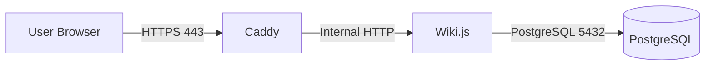
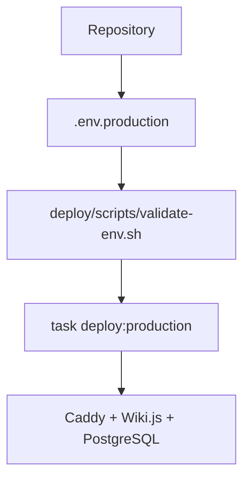
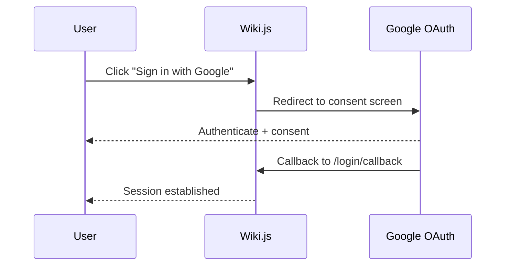

# Architecture Overview

This repository deploys a three-service stack using Docker Compose:

- **Caddy**: public TLS terminator and reverse proxy
- **Wiki.js**: application and content layer
- **PostgreSQL**: persistent datastore

## High-Level Architecture

## Service Relationships

| Service | Depends On | Network Exposure | Persistent Storage |
| --- | --- | --- | --- |
| Caddy | Wiki.js started | Public ports `80/443` | `caddy_data`, `caddy_config` |
| Wiki.js | PostgreSQL health | Internal only | `wikijs_data` |
| PostgreSQL | None | Internal only | `postgres_data` |

## Docker Networking

The stack defines two Compose networks:

- `edge`: ingress network for Caddy host port bindings
- `internal`: private network for service-to-service traffic

PostgreSQL and Wiki.js run only on `internal`. Caddy bridges `edge` and `internal`.

## Deployment Overview

Deployments are environment-driven and use `deploy/production/docker-compose.production.yml` as the production overlay.

## Authentication Flow

Google OAuth is used as the identity provider for Wiki.js.

OAuth credentials and callback URL are configured through environment variables.

## Repository Organization

- `.github/specs/`: source specifications
- `.devcontainer/` and `.vscode/`: contributor onboarding defaults
- `config/`: service configuration (Caddy and Wiki.js)
- `deploy/`: production deployment overlay, scripts, and examples
- `docs/`: architecture, setup portal, and operational documentation
- `scripts/`: backup/restore/bootstrap scaffolding
- `theme/`, `assets/`, `wiki/`: campaign content and design assets
